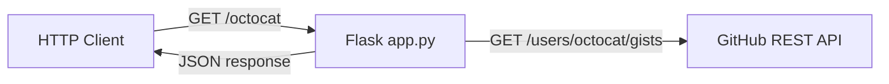
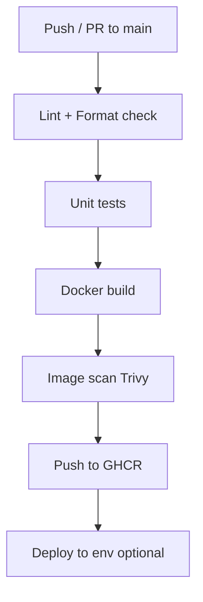

# Equal Experts Operability Interview — Comprehensive Preparation Guide

> **Local use only.** This file is for your personal interview preparation on your machine. It is **not part of your assignment submission** and should **not be committed or pushed** to the repo. Keep it locally (it is listed in `.gitignore`).

This document is your single reference for preparing for the Operability Engineer interview based on your GitHub Gists API assignment submission. It is written for a **DevOps engineer** who needs to understand every line of code, container, CI/CD, security, orchestration, and observability topic — not assume prior Python expertise.

**Prep timeline:** 2 days (see [Section 16](#16-2-day-practice-schedule)).

**Your submission files (what interviewers will see):**
- [`app.py`](app.py) — Flask HTTP API
- [`test_app.py`](test_app.py) — Unit tests with mocks
- [`requirements.txt`](requirements.txt) — Pinned Python dependencies
- [`Dockerfile`](Dockerfile) — Container packaging
- [`.dockerignore`](.dockerignore) — Build context exclusions
- [`SOLUTION.md`](SOLUTION.md) — Setup and run instructions

There is **no GitHub Actions workflow in the repo yet** — treat CI/CD as both a discussion topic and a likely live-extension task in the interview.

---

## Table of Contents

1. [Assignment Recap](#1-assignment-recap)
2. [Architecture Overview](#2-architecture-overview)
3. [Python & App Terminology Primer](#3-python--app-terminology-primer)
4. [Line-by-Line: app.py](#4-line-by-line-apppy)
5. [Line-by-Line: test_app.py](#5-line-by-line-test_apppy)
6. [Line-by-Line: Dockerfile](#6-line-by-line-dockerfile)
7. [Docker Best Practices](#7-docker-best-practices)
8. [Application Security](#8-application-security)
9. [Optional Features — Live-Coding Prep](#9-optional-features--live-coding-prep)
10. [CI/CD with GitHub Actions](#10-cicd-with-github-actions)
11. [Container Orchestration (Kubernetes)](#11-container-orchestration-kubernetes)
12. [Observability](#12-observability)
13. [Why Did You Choose X? — Cheat Sheet](#13-why-did-you-choose-x--cheat-sheet)
14. [Interview Question Bank with Answer Pointers](#14-interview-question-bank-with-answer-pointers)
15. [Commands Cheat Sheet](#15-commands-cheat-sheet)
16. [2-Day Practice Schedule](#16-2-day-practice-schedule)
17. [Mock Interview Script](#17-mock-interview-script)
18. [Known Fixes Before Interview](#18-known-fixes-before-interview)

---

## 1. Assignment Recap

### Required (must implement)

| Requirement | Your implementation |
|-------------|---------------------|
| HTTP API at `/<USER>` returning public GitHub Gists | `GET /<username>` in `app.py` |
| Automated test(s) — `octocat` as example user | `test_app.py` with mocked GitHub responses |
| Docker container listening on port **8080** | `Dockerfile` with `EXPOSE 8080` |
| README/SOLUTION docs for setup | `SOLUTION.md` |

### Optional (interviewers may ask you to add live)

| Feature | GitHub API support |
|---------|-------------------|
| **Pagination** | `?page=1&per_page=30` query parameters |
| **Caching** | Reduce GitHub API calls / improve latency |

### What you delivered (good baseline)

- Minimal Flask + `requests` API
- 2 mocked unit tests (happy path + 404 user not found)
- Slim Python image (`python:3.12-slim`), non-root user, `.dockerignore`
- Pinned dependencies in `requirements.txt` (`Flask==3.0.3`, `requests==2.32.3`)

---

## 2. Architecture Overview

When a client calls your API, this is the request flow:



**Step-by-step (for `curl http://localhost:8080/octocat`):**

1. Client sends HTTP GET to your Flask app on port 8080
2. Flask matches the route `/<username>` — `username` = `"octocat"`
3. Route handler calls `fetch_public_gists("octocat")`
4. `requests.get()` calls `https://api.github.com/users/octocat/gists`
5. GitHub returns JSON array of gist objects
6. Your code transforms each gist into a simplified shape (id, description, url, files)
7. Flask returns JSON: `{"username": "octocat", "gists": [...]}` with HTTP 200

**Example successful response:**

```json
{
  "username": "octocat",
  "gists": [
    {
      "id": "abc123",
      "description": "Example config",
      "url": "https://gist.github.com/octocat/abc123",
      "files": ["config.yml"]
    }
  ]
}
```

**Example error response (user not found):**

```json
{
  "error": "GitHub user not found"
}
```

HTTP status: `404`

---

## 3. Python & App Terminology Primer

Learn these terms — interviewers will use them when discussing your code.

| Term | Meaning in your solution |
|------|--------------------------|
| **Module** | A `.py` file (`app.py`, `test_app.py`) |
| **Import** | Brings code from another module or library into your file |
| **Virtual environment (venv)** | Isolated Python dependencies on your laptop — not used inside Docker |
| **Dependency / package** | External library (`Flask`, `requests`) listed in `requirements.txt` |
| **Pinning** | Exact version (`Flask==3.0.3`) for reproducible builds |
| **HTTP route / endpoint** | URL pattern your app handles (`GET /<username>`) |
| **Decorator** | Syntax like `@app.get(...)` that registers a function as a route handler |
| **JSON** | Data format for API request/response bodies |
| **Status code** | HTTP result: `200` OK, `404` Not Found, `500` Server Error |
| **Mock** | Fake object in tests so you don't call the real GitHub API |
| **Test client** | Flask helper that simulates HTTP requests without starting a real server |
| **WSGI app** | Standard interface between web server and Python web framework (Flask is WSGI) |
| **List comprehension** | `[expr for item in list]` — concise way to build a new list |
| **f-string / format** | `"https://.../{username}".format(username=x)` — inserts variable into string |
| **Tuple return** | `return body, 404` — Flask accepts `(response, status_code)` |
| **PID 1** | First process in a container — receives signals (e.g. SIGTERM on stop) |

---

## 4. Line-by-Line: app.py

Study this until you can explain every line without reading notes.

### Imports and setup (lines 1–7)

```python
from flask import Flask, jsonify      # Flask = web framework; jsonify = return JSON HTTP responses
import requests                         # HTTP client library to call GitHub API

GITHUB_API_URL = "https://api.github.com/users/{username}/gists"  # Template URL with placeholder

app = Flask(__name__)                   # Creates the web application object
                                        # __name__ = current module name ("app" when run as app.py)
```

- **`Flask`**: Creates a web application that maps URLs to Python functions
- **`jsonify`**: Converts Python dicts/lists into HTTP responses with `Content-Type: application/json`
- **`requests`**: Industry-standard library for making HTTP calls from Python (like `curl` in code)
- **`GITHUB_API_URL`**: Constant — keeps the URL in one place (easy to change/test)
- **`app = Flask(__name__)`**: The central application object; all routes attach to it

### Business logic: fetch_public_gists (lines 10–30)

```python
def fetch_public_gists(username):
    response = requests.get(
        GITHUB_API_URL.format(username=username),   # Substitute {username} in URL
        headers={"Accept": "application/vnd.github+json"},  # GitHub's versioned REST media type
        timeout=5,                                   # Fail after 5 seconds — operability critical
    )

    if response.status_code == 404:
        return None                                  # Signal: user not found

    response.raise_for_status()                      # Raise exception for 5xx, 401, 403, etc.

    return [
        {
            "id": gist["id"],
            "description": gist["description"],
            "url": gist["html_url"],
            "files": list(gist["files"].keys()),     # GitHub returns dict of files; you return filenames only
        }
        for gist in response.json()                  # List comprehension over GitHub's JSON array
    ]
```

**Key design decision:** Business logic is separated from the HTTP route handler. This makes it easier to test and reuse.

| Line / concept | Why it matters |
|----------------|----------------|
| `headers={"Accept": "application/vnd.github+json"}` | GitHub recommends this header for their REST API v3+ |
| `timeout=5` | Prevents hung threads if GitHub is slow or unreachable — essential for operability |
| `if response.status_code == 404: return None` | Maps GitHub "user not found" to your app's error handling |
| `response.raise_for_status()` | Converts HTTP errors (500, 403) into Python exceptions — currently unhandled, would become 500 |
| List comprehension | Transforms GitHub's full gist payload into your stable API contract |
| Subset of fields | You intentionally don't expose all GitHub fields — simpler, stable API |

### Route handler (lines 33–40)

```python
@app.get("/<username>")                 # Register GET handler; <username> is a path variable
def get_user_gists(username):
    gists = fetch_public_gists(username)

    if gists is None:
        return jsonify({"error": "GitHub user not found"}), 404   # Tuple: (body, status_code)

    return jsonify({"username": username, "gists": gists})
```

- **`@app.get("/<username>")`**: Flask 2.x+ shortcut for `@app.route("/<username>", methods=["GET"])`
- **Path variable**: Whatever is in the URL after `/` becomes the `username` parameter
- **Return tuple**: `jsonify(...), 404` tells Flask to send HTTP 404 with JSON body

### Entry point (lines 43–44)

```python
if __name__ == "__main__":              # Only runs when executed directly (python app.py)
    app.run(host="0.0.0.0", port=8080)  # 0.0.0.0 = listen on ALL interfaces (required in Docker)
```

- **`if __name__ == "__main__"`**: When `test_app.py` does `from app import app`, this block does NOT run
- **`host="0.0.0.0"`**: Without this, Flask only listens on `127.0.0.1` (localhost) — Docker port mapping would fail
- **`port=8080`**: Matches assignment requirement and Dockerfile `EXPOSE`

### Gaps to acknowledge (shows maturity in interview)

| Gap | Production improvement |
|-----|-------------------------|
| Flask dev server | Use **Gunicorn** or **uWSGI** behind nginx/Ingress |
| No input validation | Validate username against GitHub rules: `[a-zA-Z0-9-]{1,39}` |
| No rate limit handling | Handle GitHub HTTP 403 + `X-RateLimit-*` headers |
| No `/health` or `/ready` | Add for Kubernetes probes |
| No structured logging | Add JSON logs to stdout |
| Unhandled exceptions | Catch `requests` errors → return 502 with generic message |

---

## 5. Line-by-Line: test_app.py

### Why mock?

Tests must be **fast, deterministic, and offline** — not dependent on GitHub uptime, rate limits, or network.

### Imports and setup (lines 1–9)

```python
import unittest                           # Python's built-in test framework
from unittest.mock import Mock, patch   # Mock = fake object; patch = temporarily replace something

from app import app                      # Import the Flask app object (not running a server)


class GistApiTests(unittest.TestCase):   # Test class — groups related tests
    def setUp(self):                     # Runs BEFORE each test method
        self.client = app.test_client()  # In-memory HTTP client — no real network port
```

- **`unittest.TestCase`**: Base class providing assertion methods (`assertEqual`, etc.)
- **`setUp`**: Creates a fresh test client before every test — tests don't affect each other
- **`app.test_client()`**: Simulates HTTP requests against your Flask app in-process

### Test 1: Happy path (lines 11–44)

```python
@patch("app.requests.get")              # Replace requests.get in the app module with a Mock
def test_returns_public_gists_for_user(self, mock_get):
    mock_get.return_value = Mock(        # Configure what the fake requests.get returns
        status_code=200,
        json=Mock(return_value=[{...}]), # json() is a method on response — must be Mock too
        raise_for_status=Mock(),         # No-op — does nothing when called
    )

    response = self.client.get("/octocat")   # Simulate HTTP GET (no real server)

    self.assertEqual(response.status_code, 200)
    self.assertEqual(response.get_json(), {...})  # Compare full JSON body
```

**What this proves:** Your API correctly transforms GitHub's response shape into your API contract.

**Important mock detail:** `response.json()` is a **method** on the real `requests` Response object, so the mock must use `json=Mock(return_value=[...])`, not `json=[...]`.

### Test 2: User not found (lines 46–53)

```python
@patch("app.requests.get")
def test_returns_404_when_github_user_is_not_found(self, mock_get):
    mock_get.return_value = Mock(status_code=404)

    response = self.client.get("/unknown-user")

    self.assertEqual(response.status_code, 404)
    self.assertEqual(response.get_json(), {"error": "GitHub user not found"})
```

**What this proves:** When GitHub returns 404, your API returns a consistent JSON error with HTTP 404.

### Tests you should be ready to add live

| Test case | Expected behavior |
|-----------|-------------------|
| GitHub returns 500 | Currently unhandled → 500; production should return 502 |
| Empty gist list `[]` | Return 200 with `"gists": []` |
| GitHub rate limit 403 | Return 503 or 429 with retry guidance |
| Invalid username format | Return 400 before calling GitHub |

### Example: test for empty gist list

```python
@patch("app.requests.get")
def test_returns_empty_list_when_user_has_no_gists(self, mock_get):
    mock_get.return_value = Mock(
        status_code=200,
        json=Mock(return_value=[]),
        raise_for_status=Mock(),
    )

    response = self.client.get("/octocat")

    self.assertEqual(response.status_code, 200)
    self.assertEqual(response.get_json(), {"username": "octocat", "gists": []})
```

---

## 6. Line-by-Line: Dockerfile

Your current [`Dockerfile`](Dockerfile):

```dockerfile
FROM python:3.12-slim

RUN apt-get update \
    && apt-get upgrade -y --no-install-recommends \
    && rm -rf /var/lib/apt/lists/*

WORKDIR /app

COPY requirements.txt .
RUN pip install --no-cache-dir -r requirements.txt

COPY app.py .

RUN adduser --disabled-password --gecos "" appuser
USER appuser

EXPOSE 8080

CMD ["python", "app.py"]
```

| Line | What it does | Why it matters |
|------|--------------|----------------|
| `FROM python:3.12-slim` | Base image: Python 3.12 on Debian slim | Smaller attack surface vs full image; official Python image |
| `apt-get update && upgrade` | Patches OS packages at build time | Security hygiene; reduces known CVEs in base OS |
| `rm -rf /var/lib/apt/lists/*` | Deletes apt cache | Smaller image layers |
| `WORKDIR /app` | Sets working directory | Cleaner paths; default for subsequent commands |
| `COPY requirements.txt .` | Copy deps file **first** | **Layer caching**: deps change less often than app code |
| `RUN pip install --no-cache-dir -r requirements.txt` | Install Python packages | `--no-cache-dir` shrinks image; separate layer from app code |
| `COPY app.py .` | Copy application | Rebuilds fast when only code changes |
| `adduser ... appuser` + `USER appuser` | Run as non-root | **Container security** — limits blast radius if compromised |
| `EXPOSE 8080` | Documents intended port | Informational only; `-p 8080:8080` still required at `docker run` |
| `CMD ["python", "app.py"]` | Default container command | **Exec form** — PID 1 is `python`, receives SIGTERM properly |

### .dockerignore

Your [`.dockerignore`](.dockerignore):

```
.git
.venv
__pycache__
*.pyc
```

Excludes version control, local virtualenv, and Python bytecode — faster builds, smaller build context, no junk in image.

---

## 7. Docker Best Practices

### What you already do well

1. Use official slim base image
2. Copy dependency manifest before application code (layer caching)
3. Run as non-root user
4. Use `.dockerignore`
5. Pin Python package versions in `requirements.txt`
6. Use exec-form CMD (not shell form)

### Improvements to discuss in interview

| Practice | Example | Why |
|----------|---------|-----|
| Pin base image by digest | `FROM python:3.12-slim@sha256:abc123...` | Immutable builds — same image every time |
| Add HEALTHCHECK | See below | Container orchestrators can detect unhealthy containers |
| Production WSGI server | Gunicorn instead of Flask dev server | Dev server is single-threaded, not production-safe |
| Multi-stage build | Build deps in stage 1, copy artifacts to stage 2 | Smaller final image (more relevant for compiled languages) |
| Scan in CI | Trivy, Grype, Docker Scout | Catch CVEs before deploy |
| No secrets in image | Use env vars / K8s Secrets at runtime | Secrets in layers can be extracted |

### Sample HEALTHCHECK addition

Requires adding a `/health` endpoint to `app.py` first:

```dockerfile
HEALTHCHECK --interval=30s --timeout=3s --start-period=5s --retries=3 \
  CMD python -c "import urllib.request; urllib.request.urlopen('http://localhost:8080/health')" || exit 1
```

Or install `curl` in the image (adds size) and use `curl -f http://localhost:8080/health`.

### Production CMD with Gunicorn

```dockerfile
# Add to requirements.txt: gunicorn==22.0.0
CMD ["gunicorn", "-b", "0.0.0.0:8080", "-w", "2", "app:app"]
```

**`app:app`** means: Python module `app.py`, Flask instance variable named `app`.

- `-w 2` = 2 worker processes (handles concurrent requests)
- Gunicorn is production-grade; Flask's built-in server is for development only

### Layer caching strategy (interview answer)

"I copy `requirements.txt` and run `pip install` before copying `app.py`. Docker caches each layer. Dependencies change rarely; application code changes often. When I edit `app.py`, Docker reuses the cached pip install layer and only rebuilds from the `COPY app.py` step onward. This makes iterative development much faster."

---

## 8. Application Security

| Area | Your current state | What to say / improve |
|------|-------------------|----------------------|
| **Non-root container** | Implemented | Prevents container escape leading to root on host |
| **Dependency pinning** | `requirements.txt` pinned | Reproducible builds; scan with `pip-audit` / Dependabot |
| **Outbound HTTP timeout** | 5s timeout | Prevents resource exhaustion from hung connections |
| **Input validation** | Missing | Validate username: `[a-zA-Z0-9-]{1,39}` (GitHub username rules) |
| **SSRF** | Low risk | URL is templated to fixed GitHub domain — never allow arbitrary URLs |
| **Secrets** | None in repo | GitHub token via env var if needed for higher rate limits |
| **Rate limiting (inbound)** | Missing | Protect your API with Flask-Limiter or API gateway |
| **Error leakage** | `raise_for_status()` unhandled | Catch exceptions → generic 502, log details server-side only |
| **TLS** | N/A in container | Terminate TLS at Ingress/load balancer |
| **Supply chain** | Basic | Add SBOM generation, image signing (Cosign) in CI |

### Strong interview answer pattern

> "For this exercise I prioritized simplicity and container hardening. For production I'd add input validation, health checks, structured logging, rate-limit handling for GitHub 403, and a production WSGI server behind TLS termination at the Ingress."

### Example input validation (live-coding reference)

```python
import re

USERNAME_PATTERN = re.compile(r"^[a-zA-Z0-9-]{1,39}$")

@app.get("/<username>")
def get_user_gists(username):
    if not USERNAME_PATTERN.match(username):
        return jsonify({"error": "Invalid username format"}), 400
    # ... rest of handler
```

### GitHub rate limits (know the numbers)

- **Unauthenticated**: 60 requests/hour per IP
- **Authenticated** (with token): 5,000 requests/hour
- Response headers: `X-RateLimit-Remaining`, `X-RateLimit-Reset`
- HTTP 403 when exceeded

---

## 9. Optional Features — Live-Coding Prep

Practice implementing these in 20–30 minutes each.

### A. Pagination

**GitHub API:** `GET /users/{username}/gists?page=2&per_page=10`

**Approach:**

```python
from flask import request

@app.get("/<username>")
def get_user_gists(username):
    page = request.args.get("page", default=1, type=int)
    per_page = request.args.get("per_page", default=30, type=int)
    per_page = min(per_page, 100)  # Cap to prevent abuse

    gists = fetch_public_gists(username, page=page, per_page=per_page)
    # ...
```

Update `fetch_public_gists` to pass params:

```python
response = requests.get(
    GITHUB_API_URL.format(username=username),
    params={"page": page, "per_page": per_page},
    headers={"Accept": "application/vnd.github+json"},
    timeout=5,
)
```

**Response shape with pagination metadata:**

```json
{
  "username": "octocat",
  "page": 1,
  "per_page": 30,
  "gists": [...]
}
```

**Talking points:**
- Default `page=1`, `per_page=30`
- Cap `per_page` at 100 to prevent abuse
- GitHub returns a `Link` header with `rel="next"` / `rel="prev"` — can pass through for HATEOAS
- Backward compatible: clients ignoring query params get page 1

### B. Caching

| Approach | Pros | Cons |
|----------|------|------|
| **In-memory dict + TTL** | Simple, no infra | Lost on restart; not shared across replicas |
| **Redis** | Shared cache, TTL, operability standard | Extra dependency to operate |
| **HTTP Cache-Control** | CDN/browser friendly | Doesn't reduce GitHub calls server-side |

**In-memory cache example (simplest for live coding):**

```python
import time

_cache = {}  # key -> (expiry_timestamp, data)

def get_cached(key, ttl_seconds=300):
    if key in _cache:
        expiry, data = _cache[key]
        if time.time() < expiry:
            return data
    return None

def set_cache(key, data, ttl_seconds=300):
    _cache[key] = (time.time() + ttl_seconds, data)
```

**Cache key:** `gists:{username}:page:{n}`  
**TTL:** 60–300 seconds for public data

**Interview talking point:** "For a single replica, in-memory is fine. For multiple replicas behind a load balancer, I'd use Redis so all pods share the same cache."

### C. Health endpoints

```python
@app.get("/health")
def health():
    return jsonify({"status": "ok"}), 200

@app.get("/ready")
def ready():
    try:
        response = requests.get(
            "https://api.github.com/rate_limit",
            headers={"Accept": "application/vnd.github+json"},
            timeout=2,
        )
        response.raise_for_status()
        return jsonify({"status": "ready"}), 200
    except requests.RequestException:
        return jsonify({"status": "not ready"}), 503
```

| Endpoint | Kubernetes probe | Purpose |
|----------|-----------------|---------|
| `/health` | Liveness | Process is alive — restart if failing |
| `/ready` | Readiness | Can serve traffic — remove from load balancer if failing |

---

## 10. CI/CD with GitHub Actions

There is no workflow in the repo yet. For **local prep**, study and whiteboard this section — you do not need to create or push a workflow unless the interviewer asks you to live in the session.

### Branching strategy

**Trunk-based development** (Equal Experts tends to favor simplicity):

- Short-lived feature branches → PR → merge to `main`
- `main` is always deployable
- Tags/releases for production (`v1.0.0`)
- Avoid long-lived GitFlow branches if the team prefers continuous delivery



### Example workflow: `.github/workflows/ci.yml`

```yaml
name: CI

on:
  push:
    branches: [main]
  pull_request:
    branches: [main]

concurrency:
  group: ci-${{ github.ref }}
  cancel-in-progress: true

jobs:
  lint:
    runs-on: ubuntu-latest
    steps:
      - uses: actions/checkout@v4
      - uses: actions/setup-python@v5
        with:
          python-version: "3.12"
      - run: pip install ruff
      - run: ruff check .
      - run: ruff format --check .

  test:
    runs-on: ubuntu-latest
    steps:
      - uses: actions/checkout@v4
      - uses: actions/setup-python@v5
        with:
          python-version: "3.12"
      - uses: actions/cache@v4
        with:
          path: ~/.cache/pip
          key: pip-${{ hashFiles('requirements.txt') }}
      - run: pip install -r requirements.txt
      - run: python -m unittest -v

  build-and-push:
    needs: [lint, test]
    if: github.event_name == 'push' && github.ref == 'refs/heads/main'
    runs-on: ubuntu-latest
    permissions:
      contents: read
      packages: write
    steps:
      - uses: actions/checkout@v4

      - name: Log in to GHCR
        uses: docker/login-action@v3
        with:
          registry: ghcr.io
          username: ${{ github.actor }}
          password: ${{ secrets.GITHUB_TOKEN }}

      - name: Build and push
        uses: docker/build-push-action@v6
        with:
          push: true
          tags: |
            ghcr.io/${{ github.repository }}:${{ github.sha }}
            ghcr.io/${{ github.repository }}:main

      - name: Scan image with Trivy
        uses: aquasecurity/trivy-action@master
        with:
          image-ref: ghcr.io/${{ github.repository }}:${{ github.sha }}
          severity: CRITICAL,HIGH
          exit-code: 1
```

### Tooling choices (Python ecosystem)

| Purpose | Tool | Why |
|---------|------|-----|
| Lint | **Ruff** | Fast, replaces flake8 + isort + many rules |
| Format | **Ruff format** or Black | Consistent style, enforced in CI |
| Test | **unittest** (yours) or pytest | pytest is more popular; yours is fine for the exercise |
| Deps scan | **pip-audit** / Dependabot | Finds vulnerable packages |
| Image scan | **Trivy** | Standard in DevOps pipelines |

### Tagging and image registry strategy

| Event | Tag pattern | Notes |
|-------|-------------|-------|
| PR builds | `ghcr.io/org/app:pr-42-abc1234` | Never tag PR builds as `:latest` |
| Main merges | `ghcr.io/org/app:sha-abc1234` + `:main` | Immutable SHA tag for traceability |
| Releases | `ghcr.io/org/app:v1.2.3` | Semver from git tag |
| Production deploy | Pin by **digest** | `@sha256:...` — never rely on mutable tags alone |

### CI best practices to mention

- Cache pip dependencies (`actions/cache`)
- Fail fast: lint → test → build → scan
- Branch protection: require CI green + 1 review before merge
- Secrets in GitHub Actions secrets (never in Dockerfile or code)
- OIDC to cloud providers (no long-lived AWS keys in CI)
- Concurrency groups to cancel stale PR runs
- Separate jobs for lint, test, build — parallel where possible

---

## 11. Container Orchestration (Kubernetes)

Be ready to deploy your container to Kubernetes conceptually or live.

### Minimal manifest set

| Resource | Purpose |
|----------|---------|
| **Deployment** | Desired state: N replicas of your container image |
| **Service** | Stable internal IP/DNS exposing port 8080 to other pods |
| **Ingress** | External HTTP routing + TLS termination |
| **ConfigMap** | Non-secret config (cache TTL, log level) |
| **Secret** | GitHub token if needed for higher rate limits |

### Example Deployment with probes

```yaml
apiVersion: apps/v1
kind: Deployment
metadata:
  name: github-gists-api
spec:
  replicas: 2
  selector:
    matchLabels:
      app: github-gists-api
  strategy:
    type: RollingUpdate
    rollingUpdate:
      maxUnavailable: 0
      maxSurge: 1
  template:
    metadata:
      labels:
        app: github-gists-api
    spec:
      securityContext:
        runAsNonRoot: true
        runAsUser: 1000
      containers:
        - name: api
          image: ghcr.io/org/github-gists-api:sha-abc1234
          ports:
            - containerPort: 8080
          resources:
            requests:
              cpu: 100m
              memory: 128Mi
            limits:
              cpu: 500m
              memory: 256Mi
          livenessProbe:
            httpGet:
              path: /health
              port: 8080
            initialDelaySeconds: 5
            periodSeconds: 10
          readinessProbe:
            httpGet:
              path: /ready
              port: 8080
            initialDelaySeconds: 5
            periodSeconds: 10
```

### Example Service

```yaml
apiVersion: v1
kind: Service
metadata:
  name: github-gists-api
spec:
  selector:
    app: github-gists-api
  ports:
    - port: 80
      targetPort: 8080
  type: ClusterIP
```

### Example Ingress

```yaml
apiVersion: networking.k8s.io/v1
kind: Ingress
metadata:
  name: github-gists-api
  annotations:
    cert-manager.io/cluster-issuer: letsencrypt-prod
spec:
  tls:
    - hosts:
        - gists.example.com
      secretName: gists-tls
  rules:
    - host: gists.example.com
      http:
        paths:
          - path: /
            pathType: Prefix
            backend:
              service:
                name: github-gists-api
                port:
                  number: 80
```

### Probe types

| Probe | Endpoint | Action if failing |
|-------|----------|-------------------|
| **Liveness** | `/health` | Kubernetes restarts the pod |
| **Readiness** | `/ready` | Pod removed from Service endpoints (no traffic) |
| **Startup** | `/health` | Delays liveness/readiness until app is ready (for slow starts) |

### Other operability topics

| Topic | What to say |
|-------|-------------|
| **HPA** | Scale replicas on CPU or custom metric (request latency) |
| **Resource limits/requests** | Prevent noisy neighbor; requests = guaranteed, limits = cap |
| **PodDisruptionBudget** | Ensure minimum replicas during node drains / rollouts |
| **NetworkPolicy** | Egress only to `api.github.com:443` |
| **Rolling update** | `maxUnavailable: 0`, `maxSurge: 1` for zero-downtime deploys |
| **Zero-downtime deploy** | Readiness probe ensures new pods receive traffic only when ready; old pods drained gracefully |

### Local practice path

```bash
docker build -t github-gists-api .
docker run --rm -p 8080:8080 github-gists-api
# Then deploy to minikube or kind for K8s practice
```

---

## 12. Observability

Your app has **no observability today** — expect "how would you operate this in production?"

### Logging

Replace implicit prints with **structured JSON logging**:

```python
import logging
import json

class JsonFormatter(logging.Formatter):
    def format(self, record):
        return json.dumps({
            "level": record.levelname,
            "message": record.getMessage(),
            "username": getattr(record, "username", None),
            "latency_ms": getattr(record, "latency_ms", None),
        })

logger = logging.getLogger(__name__)
```

**Log these fields per request:**
- `request_id` (correlation ID)
- `username`
- `latency_ms`
- `github_status`
- `error_type`

**Shipping:** stdout → container runtime → Fluent Bit / Datadog / ELK

### Metrics (Prometheus)

| Metric | Type | Labels |
|--------|------|--------|
| `http_requests_total` | Counter | `path`, `status` |
| `http_request_duration_seconds` | Histogram | `path` |
| `github_api_calls_total` | Counter | `status` |

Tools: `prometheus-flask-exporter` or OpenTelemetry SDK.

### Tracing

- OpenTelemetry auto-instrumentation for Flask + requests
- Trace span: incoming HTTP request → outbound GitHub API call
- Export to Jaeger, Tempo, or Datadog APM

### Alerting examples

| Alert | Condition | Severity |
|-------|-----------|----------|
| High error rate | > 5% 5xx for 5 min | Critical |
| High latency | p99 > 2s for 5 min | Warning |
| GitHub rate limit | 403 rate increasing | Warning |
| Pod restart loop | Liveness probe failing repeatedly | Critical |

### SRE framing

| Concept | Your app example |
|---------|-----------------|
| **SLI** (Service Level Indicator) | Availability (% of 2xx responses), latency (p95) |
| **SLO** (Service Level Objective) | 99.9% availability, p95 < 500ms |
| **Error budget** | Allowed downtime/latency degradation before slowing releases |
| **SLA** | Contract with users — usually SLO minus margin |

---

## 13. Why Did You Choose X? — Cheat Sheet

Prepare 30-second answers for each:

| Choice | Your answer |
|--------|-------------|
| **Python + Flask** | Fast to build, readable, good for exercise scope; widely understood |
| **requests** | Simple synchronous HTTP client; adequate for low-traffic API |
| **unittest + mock** | Built into Python — no extra test dependencies; runs with `python -m unittest` |
| **Separate `fetch_public_gists()`** | Testable business logic; route handler stays thin (separation of concerns) |
| **Subset gist fields** | Stable API contract; don't leak all GitHub internals to consumers |
| **404 → JSON error body** | Consistent API error format for clients |
| **timeout=5** | Operability: fail fast on upstream issues, don't hang threads |
| **python:3.12-slim** | Balance of image size, wheel compatibility, official support |
| **non-root user** | Security baseline for containers — limits blast radius |
| **COPY requirements before app** | Docker layer cache optimization — faster rebuilds |
| **No pagination/caching yet** | Met required scope within 90 min; optional items are documented next steps |
| **Mock in tests** | Fast, deterministic, no dependency on GitHub uptime or rate limits |
| **Pinned deps** | Reproducible builds in Docker and CI |

---

## 14. Interview Question Bank with Answer Pointers

### 1. Walk me through what happens when I `curl localhost:8080/octocat`.

> Client sends GET /octocat → Flask route matches username="octocat" → fetch_public_gists calls GitHub API → transforms JSON → returns {"username":"octocat","gists":[...]} with 200.

### 2. Why mock GitHub in tests instead of calling the real API?

> Tests must be fast, deterministic, and offline. Real API calls are slow, can fail due to network/rate limits, and make tests flaky. Mocks let us test our transformation logic and error handling in isolation.

### 3. What happens if GitHub is down for 30 seconds?

> With timeout=5, each request fails after 5 seconds. raise_for_status() raises an exception which Flask converts to HTTP 500. In production I'd catch RequestException, return 502 Bad Gateway, log the error, and optionally add retries with backoff.

### 4. How would you add pagination without breaking existing clients?

> Add optional query params page and per_page with defaults (1 and 30). Existing clients get the same first page. New response includes page metadata. No URL path changes — backward compatible.

### 5. Explain your Dockerfile layer caching strategy.

> Copy requirements.txt and pip install before copying app.py. Dependencies change rarely; code changes often. Docker reuses the cached pip layer when only app.py changes.

### 6. Why run as non-root? What breaks when you do?

> Limits damage if the container is compromised — attacker doesn't get root on the host. Tradeoffs: can't bind to ports < 1024 (we use 8080, fine), may need to ensure file permissions are correct.

### 7. Design a GitHub Actions pipeline for this repo.

> See Section 10. Lint (ruff) → test (unittest) → docker build → Trivy scan → push to GHCR with SHA tag. Branch protection on main. Concurrency to cancel stale runs.

### 8. How do you handle GitHub API rate limits in production?

> Monitor X-RateLimit-Remaining header. Use authenticated requests (5000/hr vs 60/hr). Cache responses. Return 429 to clients with Retry-After. Alert when approaching limit.

### 9. What Kubernetes probes would you configure?

> Liveness on /health (restart if deadlocked). Readiness on /ready (remove from Service if GitHub unreachable). Startup probe if app has slow initialization.

### 10. What metrics and alerts would you set up on day one?

> Request count, error rate, latency histogram, GitHub API call count/status. Alert on error rate > 5%, p99 latency > 2s, pod restarts.

### 11. How would you deploy a new version with zero downtime?

> Rolling update with maxUnavailable: 0, maxSurge: 1. Readiness probe ensures new pods only receive traffic when ready. Old pods finish in-flight requests before termination (preStop hook + grace period).

### 12. What's wrong with using Flask's built-in server in production?

> Single-threaded, not designed for security or performance under load, no graceful worker management. Use Gunicorn with multiple workers behind a reverse proxy.

---

## 15. Commands Cheat Sheet

### Local development

```bash
# Create and activate virtual environment (Mac/Linux)
python3 -m venv .venv
source .venv/bin/activate

# Install dependencies
pip install -r requirements.txt

# Run tests
python -m unittest -v

# Run the app
python app.py

# Test the API (in another terminal)
curl -i http://localhost:8080/octocat
curl -i http://localhost:8080/unknown-user
```

### Docker

```bash
# Build image
docker build -t github-gists-api .

# Run container
docker run --rm -p 8080:8080 github-gists-api

# Inspect image layers
docker history github-gists-api

# Scan for CVEs (if Docker Scout available)
docker scout cves github-gists-api

# Run shell inside container (may fail — non-root, no shell in slim image)
docker exec -it <container_id> sh
```

### Security scanning

```bash
pip install pip-audit
pip-audit -r requirements.txt
```

### Linting (if you add ruff)

```bash
pip install ruff
ruff check .
ruff format --check .
```

---

## 16. 2-Day Practice Schedule

All work happens **locally on your machine**. You do not need to commit changes — practice by reading, running commands, and optionally editing files in a scratch copy or local branch you discard afterward.

### Day 1 — Code, Docker, and Security (~6–8 hours)

| Block | Time | Tasks |
|-------|------|-------|
| **Morning** | 2–3 h | Read Sections 1–5 of this doc. Read `app.py` and `test_app.py` aloud line by line. Set up venv, run tests, curl `/octocat`. Memorize the request flow (Section 2). |
| **Midday** | 1–2 h | Read Sections 6–7. Build and run Docker image. Run `docker history github-gists-api`. Explain each Dockerfile line out loud. |
| **Afternoon** | 2 h | Read Section 8. Practice adding `/health` locally (optional — do not commit). Run `pip-audit -r requirements.txt`. Review Section 13 cheat sheet. |
| **Evening** | 1 h | Skim Section 14 (Q&A bank). Answer questions 1–6 out loud without notes. |

**Day 1 exit criteria:** You can explain every line of `app.py`, `test_app.py`, and the Dockerfile. You can run the app locally and in Docker.

### Day 2 — Operability Topics and Mock Interview (~6–8 hours)

| Block | Time | Tasks |
|-------|------|-------|
| **Morning** | 2 h | Read Sections 9–10. Practice one optional feature locally (pagination OR caching, timed 30 min). Sketch the CI/CD pipeline on paper — do not push anywhere. |
| **Midday** | 2 h | Read Sections 11–12 (K8s + observability). Write Deployment/Service YAML in a local scratch file. Define liveness/readiness probes on paper. |
| **Afternoon** | 2 h | Run the [Mock Interview Script](#17-mock-interview-script) (Section 17) timed at 55 min. |
| **Evening** | 1 h | Re-read weak areas. Review Sections 13 + 14. Run through commands in Section 15 once more. |

**Day 2 exit criteria:** You can whiteboard CI/CD, K8s probes, and observability. You can live-code one optional feature or health endpoint under time pressure.

### What to skip (no time in 2 days)

- Pushing CI to GitHub or a test repo — **discuss and whiteboard only**
- Full observability implementation — **know the design**, don't build it
- Fixing `SOLUTION.md` typo in the repo — note it exists; only fix locally if you want
- Committing any prep notes or practice code changes

---

## 17. Mock Interview Script

Run this timed session on **Day 2 afternoon** (55 minutes total). Do it locally — no repo push required.

### Part 1: Architecture explanation (10 min)

Explain end-to-end without notes:
- What the API does
- Request flow from curl to GitHub and back
- Why you structured code this way
- What's missing for production

### Part 2: Live coding (20 min)

Pick one and implement with tests:
- Pagination with query params
- In-memory cache with TTL
- `/health` and `/ready` endpoints
- Username input validation

### Part 3: Whiteboard CI/CD + K8s + observability (15 min)

Draw and explain:
- GitHub Actions pipeline stages
- Docker build and GHCR tagging strategy
- K8s Deployment with probes
- Three metrics and two alerts you'd set up

### Part 4: Production improvements (10 min)

Answer: "What would you improve for production?"

Cover:
- Gunicorn instead of Flask dev server
- Input validation and error handling
- Health checks and probes
- Structured logging and metrics
- CI/CD with scanning
- Caching and rate limit handling

---

## 18. Known Gaps to Discuss (No Commit Required)

These are talking points for the interview — practice explaining them locally; you do not need to change the submitted repo.

| Item | Location | What to say / practice locally |
|------|----------|--------------------------------|
| Typo in activate command | `SOLUTION.md` line 30 | Know it's `activate` not `activat` — use correct command when demoing locally |
| No health endpoint | `app.py` | Practice adding `/health` on a local copy; explain how it maps to K8s probes |
| No CI workflow | `.github/workflows/` | Whiteboard the pipeline from Section 10; be ready to write `ci.yml` live if asked |
| Flask dev server | `Dockerfile` CMD | Explain Gunicorn switch for production — no need to change submitted Dockerfile |

---

## Quick Reference: File Map

```
.
├── app.py              # Flask API — main application (submitted)
├── test_app.py         # Unit tests with mocks (submitted)
├── requirements.txt    # Pinned dependencies (submitted)
├── Dockerfile          # Container build instructions (submitted)
├── .dockerignore       # Files excluded from Docker build context (submitted)
├── SOLUTION.md         # How to run locally, test, and Docker (submitted)
├── README.md           # Assignment instructions from Equal Experts
└── INTERVIEW_PREP.md   # Local prep only — gitignored, do not commit
```

Good luck with your interview.
